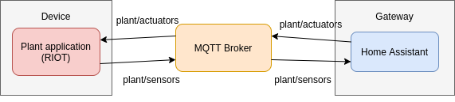

# IoT RIOT example

## Low-end IoT devices

Low-end IoT devices are based on three core components:
- A micro-controller (MCU) - a single piece of hardware containing the CPU, a few kB of RAM and ROM
- Diverse external devices such as sensors, actuators, or storage, which are connected to the MCU
- One or more network interfaces connecting the device to the Internet, typically using a low-power transmission technology

## Low-end IoT device OS requirements:
- Memory efficiency
- Energy efficiency
- Reactivity
- Network Interoperability (support for standard low-power IP stack )
- System Interoperability (OS must provide hardware abstraction so that most of the code is reusable on all IoT hardware supported by the OS)
- Security and Privacy

## RIOT

RIOT is open source OS, based on a modular architecture, built around a minimalistic kerne for low-end IoT devices. 

Some of the [features](http://riot-os.org/#features) are:
- Standard programming in C or C++
- Standard tools such as gcc, gdb, valgrind
- Minimized hardware dependent code
- Code once, run on multiple platforms 
- Partial POSIX compliance. Towards full POSIX compliance
- Develop under Linux or Mac OS using the native port, deploy on embedded device
- Enabling maximum energy-efficiency
- Real-time capability due to ultra-low interrupt latency (~50 clock cycles) and priority-based scheduling
- Multi-threading with ultra-low threading overhead (<25 bytes per thread)
- 6LoWPAN, IPv6, RPL, and UDP. CoAP and CBOR. LoRaWAN

Comparison with other low-end IoT operating systems:

| OS | Min RAM | Min ROM | C Support | C++ Support | Multi-Threading | MCU w/o MMU | Modularity | Real-Time |
| - | - | - | - | - | - | - | - | - |
| Contiki | < 2kB | < 30kB | ~ |  | ~ | X | ~ | ~ |
| Tiny OS | < 1kB | < 4KB |  |  | ~ |  |  |  |
| Linux | ~ 1MB | ~ 1MB | X | X | X |  | ~ | ~ |
| RIOT | ~ 1.5kB | ~ 5kB | X | X | X | X | X | X |


- core - implement the kernel and its basic data structures
- cpu - hardware abstraction for the functionalities related to the MCU
- boards - select, configure, and map the used CPU and drivers
- drivers - implement device drivers
- periph - provide unified access to microcontroller peripherals and is used by device drivers
- sys - implement system libraries beyond the functionalities of the kernel, such as crypto functionalities, etc
- pkg - import third-party components
- application -  high-level logic of the actual use-case

### RIOT Kernel
The kernel of RIOT initially evolved from the FireKernel project. It provides basic functionality for multi-threading: context switching, scheduling, inter-process communication (IPC), and synchronization primitives (mutex etc.)

### Hardware abstraction
The hardware abstraction in RIOT reflects this composition by structuring all hardware-dependent code into three blocks, stored in the folders boards, cpu, and drivers.
Every RIOT build includes exactly one instance of a board, one instance of a cpu implementation, and zero or more drivers.

[List of supported bords](https://github.com/RIOT-OS/RIOT/tree/master/boards)

### Sensor/Actuator Abstraction

RIOT provides a generic API for accessing sensor and actuator devices, called the Sensor Actuator Uber Layer API, SAUL


## Build
Best practice is to develop and maintain high-level application code in a separate repository which typically pulls in the particular RIOT release the application is built upon.

- Clone RIOT source code
```
git clone git@github.com:RIOT-OS/RIOT.git
```

- Checkout to a release version
```
git checkout 2021.1-branch
```

- Copy your application code in the `RIOT` directory

- Change the application Makefile to point to the `RIOT` directory

- If you have the needed [dependencies](https://github.com/RIOT-OS/RIOT/wiki/Creating-your-first-RIOT-project) you can run make command from the application folder

- If you don't have the dependencies you can do the build in the `riotbuild` docker container
```
docker run --rm -i -t -u $UID -v $(pwd):/data/riotbuild riot/riotbuild
```

## Example application
The example consists of:
-  plant device application that is using RIOT
- MQTT broker
- Home Assistant



Home assistant is open source framework meant for running on a IoT gateway. It is used for smart device management. It exposes a rich interface for automation. 

The plant device application is reading values from simulated sensors and it's publishing the values to a MQTT broker.
The Home Assistant is integrated with the MQTT broker, it's reading the values from the broker and has a dashboard with automation capabilities.
If some value that is measured is below or above the referent point, the home assistant is sending a MQTT message with the instruction for the plant device application. 
The plant device application then reads the message from the MQTT broker and sends a signal to a actuator that will turn on or of some device.

#### Plant application

Plant device application code is located in the `plant` directory.
In the Makefile you can specify the drivers, packages and configuration for the application.
The application is building for `native` device:
```
BOARD ?= native
```
When native device is used, the output `elf` can be run on linux, and it will run as a linux process.

The example is using `paho-mqtt` and `jsmn` external packages. Paho-mqtt is used for mqtt broker connection, and jsmn is used for parsing json.

To run the application you have to assign it a network interface. In the `dist/tools/tapsetup` folder there is a tool for creating a TAP virtual interface that can be used.

#### Home Assistant

In the `home-assistant/config` folder there is configuration.yaml file that is used for initial configuration of the home assistant.
The home assistant is integrated with mqtt-broker, and there are 2 sensors configured to receive values from the mqtt broker on the `plant/sensors` topic.
```yaml
mqtt:
  broker: mqtt-broker

sensor:
  - platform: mqtt
    name: "Temperature"
    state_topic: "plant/sensors"
    unit_of_measurement: "°C"
    value_template: "{{ value_json.temperature }}"
  - platform: mqtt
    name: "Humidity"
    state_topic: "plant/sensors"
    unit_of_measurement: "%"
    value_template: "{{ value_json.humidity }}"
  - platform: time_date
    display_options:
      - "time"
```

In the `automation` section are defined the events that are fired after some condition is met. If the temperature is below 19 degrees the script heater_on_mqtt is called.
```yaml
automation:
  - alias: Turn on plant room heater
    initial_state: "on"
    trigger:
      - platform: numeric_state
        entity_id: sensor.temperature
        below: 19
    action:
      service: script.heater_on_mqtt
  - alias: Turn off plant room heater
    initial_state: "on"
    trigger:
      - platform: numeric_state
        entity_id: sensor.temperature
        above: 20
    action:
      service: script.heater_off_mqtt
```

The scripts are defined in the `scripts` section:
```yaml
script:
  heater_on_mqtt:
    sequence:
      - service: mqtt.publish
        data:
          payload: '{ "heater": 1 }'
          topic: "plant/actuators"
          retain: true
```

All of these things can be configured from the web gui interface that is exposed on the 8123 port by default.

> [References](https://riot-os.org/docs/riot-ieeeiotjournal-2018.pdf)
